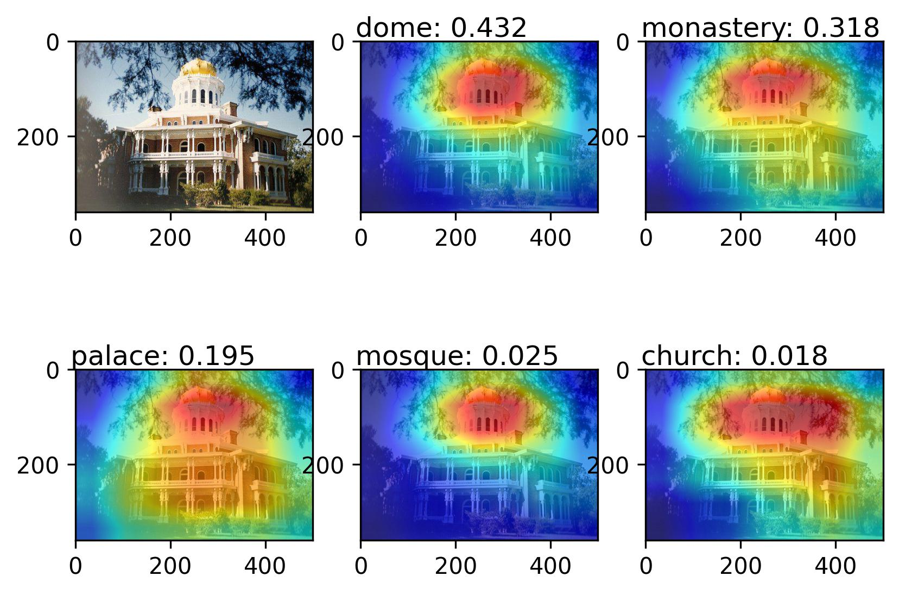

# CAM-Visualization
可视化技术——CAM  
CAM论文：[Learning Deep Features for Discriminative Localization](https://arxiv.org/pdf/1512.04150.pdf)  
GAP论文：[Network In Network](https://arxiv.org/pdf/1312.4400.pdf)  
官方仓库参考： [https://github.com/zhoubolei/CAM](https://github.com/zhoubolei/CAM)

## 说明
原论文的代码比较老了，用的pytorch版本比较旧，所以重写了一遍，用了更新的特征提取方式。  

`CAM_VGG.py`使用了VGG16，修改了原始网络的平均池化层和分类层。使用预训练的权重在MINI-ImageNet数据集上做100分类的微调。MINI-ImageNet数据集可以参考:[blog](https://blog.csdn.net/m0_46412065/article/details/128724252).
只微调全连接层，其余层保持不变。权重文件：[VGG16_100.pth](https://pan.baidu.com/s/1XE2RLEzDn8Xvw8wY0pTo1A?pwd=3v0i 
),提取码：3v0i

`CAM_ResNet.py`使用了ResNet18，ResNet本身就是GAP+FC，所以不需要修改网络，直接使用官方的预训练权重即可。
  
`class_label`分别包含了100类（[label_100.json](class_label/label_100.json)）和1000类的标签文件（[label.json](class_label/label.json)）
